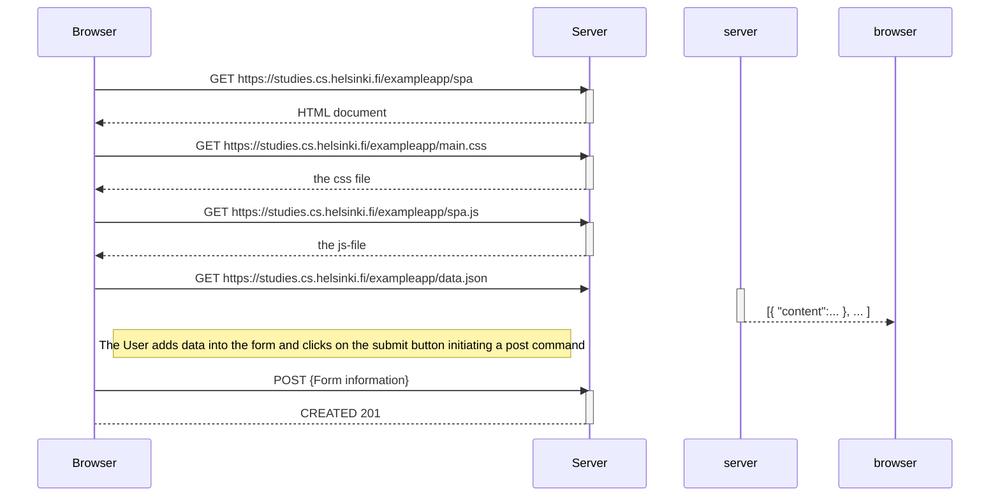

```mermaid
sequenceDiagram
    participant Browser
    participant Server
    
    Browser->>Server: GET https://studies.cs.helsinki.fi/exampleapp/spa
    activate Server
    Server-->>Browser: HTML document
    deactivate Server
    
    Browser->>Server: GET https://studies.cs.helsinki.fi/exampleapp/main.css
    activate Server
    Server-->>Browser: the css file
    deactivate Server

    Browser->>Server: GET https://studies.cs.helsinki.fi/exampleapp/spa.js
    activate Server
    Server-->>Browser: the js-file
    deactivate Server

    Browser->>Server: GET https://studies.cs.helsinki.fi/exampleapp/data.json
    activate server
    server-->>browser: [{ "content":... }, ... ]
    deactivate server    
    
    Note right of Browser: The User adds data into the form and clicks on the submit button initiating a post command

    Browser->>Server: POST {Form information}
    activate Server
    Server-->Browser: CREATED 201
    deactivate Server 
```
